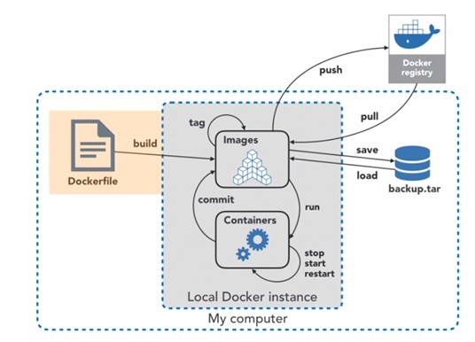

### Opearting System ##


### VM vs Container ##


### Use Cases ###

### Docker Architecture ##


### Installing Docker ##
```
[root@ip-172-31-87-240 ~]# yum install docker 
Failed to set locale, defaulting to C
Loaded plugins: extras_suggestions, langpacks, priorities, update-motd
Resolving Dependencies
--> Running transaction check
---> Package docker.x86_64 0:20.10.17-1.amzn2.0.1 will be installed
--> Processing Dependency: runc >= 1.0.0 for package: docker-20.10.17-1.amzn2.0.1.x86_64
--> Processing Dependency: libcgroup >= 0.40.rc1-5.15 for package: docker-20.10.17-1.amzn2.0.1.x86_64
--> Processing Dependency: containerd >= 1.3.2 for package: docker-20.10.17-1.amzn2.0.1.x86_64
--> Processing Dependency: pigz for package: docker-20.10.17-1.amzn2.0.1.x86_64
--> Running transaction check
---> Package containerd.x86_64 0:1.6.8-1.amzn2 will be installed
---> Package libcgroup.x86_64 0:0.41-21.amzn2 will be installed
---> Package pigz.x86_64 0:2.3.4-1.amzn2.0.1 will be installed
---> Package runc.x86_64 0:1.1.4-1.amzn2 will be installed
--> Finished Dependency Resolution

Dependencies Resolved

==========================================================================================================================
 Package                  Arch                 Version                              Repository                       Size
==========================================================================================================================
Installing:
 docker                   x86_64               20.10.17-1.amzn2.0.1                 amzn2extra-docker                39 M
Installing for dependencies:
 containerd               x86_64               1.6.8-1.amzn2                        amzn2extra-docker                27 M
 libcgroup                x86_64               0.41-21.amzn2                        amzn2-core                       66 k
 pigz                     x86_64               2.3.4-1.amzn2.0.1                    amzn2-core                       81 k
 runc                     x86_64               1.1.4-1.amzn2                        amzn2extra-docker               2.9 M

Transaction Summary
==========================================================================================================================
Install  1 Package (+4 Dependent packages)

Total download size: 69 M
Installed size: 260 M
Is this ok [y/d/N]: y
Downloading packages:
```
### Non cloud based linux vms ###
[use_link](https://docs.docker.com/engine/install/rhel/)

```
        yum install -y yum-utils device-mapper-persistent-data lvm2
	yum-config-manager --add-repo https://download.docker.com/linux/centos/docker-ce.repo
	yum list docker-ce --showduplicates | sort -r
	yum install -y docker-ce
	yum install -y docker-ce
 ```
 
 ### Start Docker ####
 ```
 [root@master ~]# systemctl status docker
● docker.service - Docker Application Container Engine
   Loaded: loaded (/usr/lib/systemd/system/docker.service; disabled; vendor preset: disabled)
   Active: inactive (dead)
     Docs: https://docs.docker.com
[root@master ~]# systemctl start docker
[root@master ~]# systemctl status docker
● docker.service - Docker Application Container Engine
   Loaded: loaded (/usr/lib/systemd/system/docker.service; disabled; vendor preset: disabled)
   Active: active (running) since Sat 2023-01-07 14:01:51 IST; 4s ago
     Docs: https://docs.docker.com
 Main PID: 1737 (dockerd)
    Tasks: 8
   Memory: 26.3M
   CGroup: /system.slice/docker.service
           └─1737 /usr/bin/dockerd -H fd:// --containerd=/run/containerd/containerd.sock

Jan 07 14:01:51 master dockerd[1737]: time="2023-01-07T14:01:51.174700466+05:30" level=info msg="scheme \"unix\" not registered, ...ule=grpc
Jan 07 14:01:51 master dockerd[1737]: time="2023-01-07T14:01:51.174717288+05:30" level=info msg="ccResolverWrapper: sending updat...ule=grpc
Jan 07 14:01:51 master dockerd[1737]: time="2023-01-07T14:01:51.174726871+05:30" level=info msg="ClientConn switching balancer to...ule=grpc
Jan 07 14:01:51 master dockerd[1737]: time="2023-01-07T14:01:51.190000182+05:30" level=info msg="Loading containers: start."
Jan 07 14:01:51 master dockerd[1737]: time="2023-01-07T14:01:51.370152512+05:30" level=info msg="Default bridge (docker0) is assi...address"
Jan 07 14:01:51 master dockerd[1737]: time="2023-01-07T14:01:51.442191457+05:30" level=info msg="Loading containers: done."
Jan 07 14:01:51 master dockerd[1737]: time="2023-01-07T14:01:51.481430544+05:30" level=info msg="Docker daemon" commit=42c8b31 gr...20.10.22
Jan 07 14:01:51 master dockerd[1737]: time="2023-01-07T14:01:51.481522668+05:30" level=info msg="Daemon has completed initialization"
Jan 07 14:01:51 master systemd[1]: Started Docker Application Container Engine.
Jan 07 14:01:51 master dockerd[1737]: time="2023-01-07T14:01:51.498441691+05:30" level=info msg="API listen on /var/run/docker.sock"
Hint: Some lines were ellipsized, use -l to show in full.
[root@master ~]#

[root@master ~]# systemctl enable docker
Created symlink from /etc/systemd/system/multi-user.target.wants/docker.service to /usr/lib/systemd/system/docker.service.
[root@master ~]#
```

#### Non Root User ###
```
[root@master ~]# useradd srini
[root@master ~]# usermod -aG docker srini
[root@master ~]# echo "welcome1"  |  passwd srini --stdin
Changing password for user srini.
passwd: all authentication tokens updated successfully.
[root@master ~]#
```

### Docker Operations ###
Pulling image from docker hub
```
[srini@master ~]$ docker images
REPOSITORY   TAG       IMAGE ID   CREATED   SIZE
[srini@master ~]$ docker  pull oraclelinux:8.4
8.4: Pulling from library/oraclelinux
a4df6f21af84: Pull complete
Digest: sha256:b81d5b0638bb67030b207d28586d0e714a811cc612396dbe3410db406998b3ad
Status: Downloaded newer image for oraclelinux:8.4
docker.io/library/oraclelinux:8.4
[srini@master ~]$

[srini@master ~]$ docker images
REPOSITORY    TAG       IMAGE ID       CREATED         SIZE
oraclelinux   8.4       97e22ab49eea   14 months ago   246MB
[srini@master ~]$
```

### Docker DB ###
```
[srini@master ~]$ docker  info   |   grep -i root
WARNING: bridge-nf-call-iptables is disabled
WARNING: bridge-nf-call-ip6tables is disabled
 Docker Root Dir: /var/lib/docker
[srini@master ~]$


[root@master ~]# cd /var/lib/docker
[root@master docker]# ls
buildkit  containers  image  network  overlay2  plugins  runtimes  swarm  tmp  trust  volumes
[root@master docker]# cd image
[root@master image]# ls
overlay2
[root@master image]# cd overlay2
[root@master overlay2]# ls
distribution  imagedb  layerdb  repositories.json
[root@master overlay2]# cd imagedb
[root@master imagedb]# ls
content  metadata
[root@master imagedb]# cd content
[root@master content]# ls
sha256
[root@master content]# cd sha256/
[root@master sha256]# ls
97e22ab49eea70a5d500e00980537605d56f30f9614b3a6d6c4ae9ddbd642489
[root@master sha256]#
```
### Creating Container ###
```
[srini@master ~]$ docker images
REPOSITORY    TAG       IMAGE ID       CREATED         SIZE
oraclelinux   8.4       97e22ab49eea   14 months ago   246MB
[srini@master ~]$

[srini@master ~]$ docker run  -it -d  --name srinic1  oraclelinux:8.4 bash
8d16b59e4388355237c1d99dcd0f95abad1f9f6732de50db2af6916d795f9d5f
[srini@master ~]$ docker ps
CONTAINER ID   IMAGE             COMMAND   CREATED         STATUS         PORTS     NAMES
8d16b59e4388   oraclelinux:8.4   "bash"    9 seconds ago   Up 7 seconds             srinic1
[srini@master ~]$
```
### Access running container using exec ###
```
[srini@master ~]$ docker exec -it srinic1  bash
[root@8d16b59e4388 /]# pwd
/
[root@8d16b59e4388 /]# uname -r
3.10.0-1160.81.1.el7.x86_64
[root@8d16b59e4388 /]# ls
bin  boot  dev  etc  home  lib  lib64  media  mnt  opt  proc  root  run  sbin  srv  sys  tmp  usr  var
[root@8d16b59e4388 /]#
[root@8d16b59e4388 /]# echo "hello" >abc.txt
[root@8d16b59e4388 /]# ls
abc.txt  bin  boot  dev  etc  home  lib  lib64  media  mnt  opt  proc  root  run  sbin  srv  sys  tmp  usr  var
[root@8d16b59e4388 /]#
```

### Copy Data from container to host then host to container ###
```
[srini@master ~]$ docker ps
CONTAINER ID   IMAGE             COMMAND   CREATED          STATUS          PORTS     NAMES
8d16b59e4388   oraclelinux:8.4   "bash"    12 minutes ago   Up 12 minutes             srinic1
[srini@master ~]$ ls
[srini@master ~]$ pwd
/home/srini
[srini@master ~]$ docker cp srinic1:/abc.txt /home/srini
[srini@master ~]$ ls
abc.txt
[srini@master ~]$

[srini@master ~]$ echo "hello world" > def.txt
[srini@master ~]$ ls
abc.txt  def.txt
[srini@master ~]$ docker cp def.txt srinic1:/
[srini@master ~]$ ls
abc.txt  def.txt
[srini@master ~]$ docker exec -it srinic1  bash
[root@8d16b59e4388 /]# ls
abc.txt  bin  boot  def.txt  dev  etc  home  lib  lib64  media  mnt  opt  proc  root  run  sbin  srv  sys  tmp  usr  var
[root@8d16b59e4388 /]#
``` 

### Remove Container and Remove Image ####
```
[srini@master ~]$ docker rm 8d16b59e4388
Error response from daemon: You cannot remove a running container 8d16b59e4388355237c1d99dcd0f95abad1f9f6732de50db2af6916d795f9d5f. Stop the container before attempting removal or force remove
[srini@master ~]$ docker stop 8d16b59e4388
8d16b59e4388
[srini@master ~]$ docker rm 8d16b59e4388
8d16b59e4388
[srini@master ~]$ docker ps
CONTAINER ID   IMAGE     COMMAND   CREATED   STATUS    PORTS     NAMES
[srini@master ~]$

[srini@master ~]$ docker rmi oraclelinux:8.4
Untagged: oraclelinux:8.4
Untagged: oraclelinux@sha256:b81d5b0638bb67030b207d28586d0e714a811cc612396dbe3410db406998b3ad
Deleted: sha256:97e22ab49eea70a5d500e00980537605d56f30f9614b3a6d6c4ae9ddbd642489
Deleted: sha256:2d3586eacb6130164c56b62fe181ddc8e324a4442c13b3fd19f6c327f002dfbe
[srini@master ~]$ docker images
REPOSITORY   TAG       IMAGE ID   CREATED   SIZE
[srini@master ~]$
```

### Docker File ###
```
        1.Dockerfile is a configuration file that contains instructions for building a Docker image
	2.Provides a more effective way to build images compared to using docker commit
	3.Dockerfile is a text file with a series of commands in it
	4.Dockerfile is doesn’t have any extension(DockerFile)
	5.Docker File executed using docker build command
	6.One dockerfile per image 
	7.Multiple .dockerIgnore files can exist, all of them are executed
	8.Two kind of files
		.dockerignore  
		.docker
	9.Docker commands are written in upper case,Args in lower case
```


### Check Resources ###
```
$docker stats
CONTAINER ID   NAME      CPU %     MEM USAGE / LIMIT    MEM %     NET I/O           BLOCK I/O   PIDS
d3f3b79b6ba5   webtest   0.12%     26.5MiB / 3.682GiB   0.70%     3.34kB / 13.9kB   0B / 0B     279
```

### pushing image to docker hub ###
```
[srini@master ~]$ docker image ls
REPOSITORY   TAG       IMAGE ID   CREATED   SIZE
[srini@master ~]$ docker pull ubuntu
Using default tag: latest
latest: Pulling from library/ubuntu
6e3729cf69e0: Pull complete
Digest: sha256:27cb6e6ccef575a4698b66f5de06c7ecd61589132d5a91d098f7f3f9285415a9
Status: Downloaded newer image for ubuntu:latest
docker.io/library/ubuntu:latest
[srini@master ~]$ docker image ls
REPOSITORY   TAG       IMAGE ID       CREATED       SIZE
ubuntu       latest    6b7dfa7e8fdb   4 weeks ago   77.8MB
[srini@master ~]$
 
[srini@master ~]$ docker  tag  ubuntu docker.io/jonnadula/ubuntu:v1

[srini@master ~]$ docker login
Login with your Docker ID to push and pull images from Docker Hub. If you don't have a Docker ID, head over to https://hub.docker.com to create one.
Username: jonnadula
Password:
WARNING! Your password will be stored unencrypted in /home/srini/.docker/config.json.
Configure a credential helper to remove this warning. See
https://docs.docker.com/engine/reference/commandline/login/#credentials-store

Login Succeeded
[srini@master ~]$

[srini@master ~]$ docker push  docker.io/jonnadula/ubuntu:v1
The push refers to repository [docker.io/jonnadula/ubuntu]
6515074984c6: Mounted from library/ubuntu
v1: digest: sha256:965fbcae990b0467ed5657caceaec165018ef44a4d2d46c7cdea80a9dff0d1ea size: 529
[srini@master ~]$

```

 

### Container Log ####


### Understanding Port Forwarding ###
Two ways to Connect
	1.Staci Port (Using -p option)
	2.Dynamic Port
Example on Static Port


#### Docker Volumes ####


